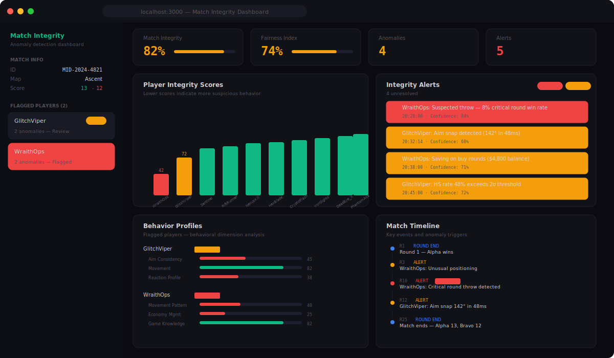

# Match Integrity Dashboard

Game match integrity analytics dashboard. Detects aim anomalies, match fixing patterns, economy exploits, and behavioral inconsistencies across competitive matches.



## Features

- **Integrity Scoring** — Per-player and per-match integrity scores based on behavioral analysis
- **Anomaly Detection** — Aim snaps, suspicious headshot rates, reaction time outliers
- **Match Fixing Detection** — Identifies throw patterns, deliberate underperformance in critical rounds
- **Economy Analysis** — Flags unusual buy/save patterns that suggest match manipulation
- **Behavior Profiles** — 5-dimension profiling: aim consistency, movement, reactions, game knowledge, economy
- **Alert System** — Severity-based alerts (critical, warning, info) with confidence scores
- **Match Timeline** — Chronological event feed highlighting suspicious moments
- **Player Comparison** — Bar chart visualization of integrity scores across all players

## Getting Started

```bash
git clone https://github.com/idirdev/match-integrity-dashboard.git
cd match-integrity-dashboard
npm install
npm run dev
```

Open [http://localhost:3000](http://localhost:3000).

## How it works

The dashboard analyzes match data across multiple dimensions:

| Dimension | What it detects |
|-----------|----------------|
| **Aim Analysis** | Snap angles, tracking consistency, headshot rate vs accuracy correlation |
| **Behavioral** | Movement patterns, reaction times, pre-fire frequency |
| **Economic** | Buy/save decisions relative to team economy and round importance |
| **Statistical** | Performance deviations from player's historical baseline |
| **Match Flow** | Round-by-round win rate in critical vs non-critical situations |

Scores are calculated per-player (0-100) and aggregated into a match integrity score.

## Tech Stack

- **Framework:** Next.js 14 (App Router)
- **Language:** TypeScript
- **Styling:** Tailwind CSS
- **Charts:** Recharts
- **Icons:** Lucide React

## Project Structure

```
src/
├── app/
│   ├── layout.tsx              # Root layout
│   ├── page.tsx                # Main dashboard
│   └── globals.css             # Global styles
├── components/
│   ├── sidebar.tsx             # Match info + flagged players
│   ├── integrity-score.tsx     # Score cards with progress bars
│   ├── anomaly-chart.tsx       # Player integrity bar chart
│   ├── player-radar.tsx        # Behavior profile breakdown
│   ├── alert-feed.tsx          # Severity-based alert list
│   └── match-timeline.tsx      # Chronological event timeline
└── lib/
    ├── types.ts                # TypeScript interfaces
    ├── mock-data.ts            # Sample match data (10 players)
    └── utils.ts                # Utility functions
```

## License

MIT — free to use, modify, and distribute.

---

## 🇫🇷 Documentation en français

### Description
Match Integrity Dashboard est un tableau de bord d'analyse de l'intégrité des matchs compétitifs. Il détecte les anomalies de visée, les schémas de match-fixing, les exploits économiques et les incohérences comportementales à travers les matchs compétitifs. Chaque joueur et chaque match reçoivent un score d'intégrité basé sur l'analyse comportementale.

### Installation
```bash
git clone https://github.com/idirdev/match-integrity-dashboard.git
cd match-integrity-dashboard
npm install
npm run dev
```

### Utilisation
Lancez l'application et importez vos données de matchs pour obtenir des analyses d'intégrité détaillées. Consultez la documentation en anglais ci-dessus pour la liste complète des détections et indicateurs disponibles.
